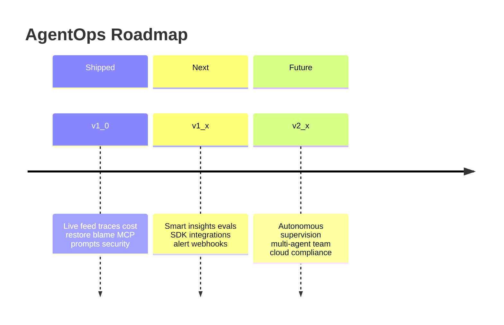

# AgentOps Roadmap

Universal observability for AI developer workflows — local-first today, team-ready tomorrow.

---

## Shipped in 1.0

Everything below is available today.

- **CLI** — `init`, `dev`, `env`, `budget`, `restore`, `trace`, `replay`, `blame`, `prompt`, `mcp`, `alerts`, `sec`, `doctor`
- **Passive collection** — OpenAI-compatible LLM proxy, shell hooks, filesystem watcher, MCP monitoring
- **Privacy** — Pre-storage scrubber (`sk-*`, AWS keys, JWTs, `.env` values); extend via `~/.agentops/scrub_patterns.txt`
- **Budgets** — Session cost/tool/LLM limits with `alert`, `pause`, or `kill` actions
- **Dashboard** (`localhost:4318`) — Live feed, traces with replay, cost & efficiency, AI blame, MCP health, prompt versions, context inspector, security center
- **Time-travel restore** — Snapshot working directory; restore to any point in a trace
- **Alerts** — Dangerous shell commands, token explosion (100k+), low efficiency, slow MCP servers

See [v1.0.0 release notes](releases/v1.0.0.md) for use cases and screenshots.

---

## Near-term: Intelligence Layer (1.x)

**Goal:** Turn raw telemetry into actionable insights. Make every developer faster and safer without adding friction.

| Feature | Why it matters |
|---|---|
| Complete context inspector | Duplicate/noisy context detection, per-file token weight, memory drift tracking |
| Configurable alerts + webhooks | Route critical alerts to Slack, Discord, or PagerDuty instead of only the dashboard |
| Smart insights callouts | "42% of tokens wasted on duplicate context", "MCP server latency 3x vs last session" |
| Prompt eval foundation | `agentops eval run <tests/>` — compare prompt versions against test cases |
| Trace diff | `agentops diff <run_a> <run_b>` — compare two agent sessions side by side |
| Self-update | `agentops upgrade` — one-command updates from GitHub Releases |
| Deep SDK hooks (optional) | LangChain, Vercel AI SDK, OpenAI Agents SDK, AutoGen, CrewAI |

---

## Mid-term: Autonomous Agent Supervision (1.x–2.x)

**Industry problem:** Background agents, cloud agents, and CI agents increasingly run with no human in the loop. Observability must include guardrails, not just logs.

| Feature | Why it matters |
|---|---|
| Run watchdog | Stale-session detection, infinite-loop alerts, retry-budget limits |
| Escalation | Webhook/Slack notification when budget is hit or a critical security alert fires |
| Approval gates | Require human confirmation before destructive shell commands, file deletes, or MCP writes |
| Cloud & CI agent tracing | Trace GitHub Actions agents, Cursor Cloud Agents, headless Codex runs |
| Agent heartbeat dashboard | "3 agents running, 1 over budget, 1 stale for 45 minutes" |
| Browser / computer-use monitoring | Observe agents that control browsers or desktop automation tools |

This layer builds on the budget, alert, and restore primitives already shipped in 1.0.

---

## Mid-term: Multi-Agent & Team (2.x)

**Industry problem:** Teams run multiple agents on the same repo. Conflicts, cost attribution, and shared learnings need a platform.

| Feature | Why it matters |
|---|---|
| Multi-agent conflict detection | Flag when Claude and Cursor both edit `auth.ts` within 30 seconds |
| Shareable trace links | "Why did the agent delete production?" — share a read-only trace URL |
| Team dashboards + cloud sync | Org-wide visibility into agent spend, success rates, and incidents |
| Prompt governance | Shared prompt library, approval workflows for prompt changes |
| Workflow analytics | Coding velocity, retry rates, hallucination rates, cost per task |
| `.agentignore` | Per-repo rules for what AgentOps should not capture |

---

## Long-term: Platform & Compliance (2.x+)

Aligned with where the AI tooling industry is heading — interoperability, auditability, and enterprise adoption.

| Feature | Why it matters |
|---|---|
| OpenTelemetry GenAI semantic conventions | Export traces to Datadog, Grafana, Honeycomb, or any OTel backend |
| RAG / retrieval pipeline tracing | See what context was injected, whether the model used it, and at what cost |
| Agent-to-agent (A2A) protocol observability | Trace multi-agent orchestration across services and frameworks |
| Compliance exports | Audit trails and retention policies for SOC2, EU AI Act, and internal governance |
| Hosted observability tier | Optional cloud dashboards, long-term retention, enterprise auth (SSO/SAML) |

---

## Principles

These do not change across releases:

1. **Zero-friction onboarding** — one command, works immediately
2. **Privacy by default** — secrets scrubbed before storage, never opt-in
3. **Passive by default** — no SDK required, no workflow disruption
4. **Agent-agnostic** — works with Cursor, Claude Code, Copilot, Aider, and custom agents
5. **Safety before features** — budgets and guardrails are core, not add-ons
6. **OpenTelemetry-compatible** — stay interoperable with the broader observability ecosystem

Full internal spec: [context.md](../context.md)

---

## How to influence the roadmap

- Open a [GitHub Issue](https://github.com/gog1withme/AgentOps/issues) for feature requests or bugs
- Vote on existing issues with 👍 to help prioritize
- Contribute via pull request — see [development.context](../development.context)
- Read or propose updates to the [Developer Q&A](qa/) — technical answers tagged by release version
