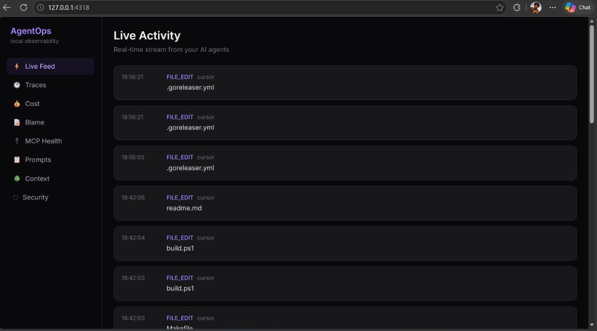
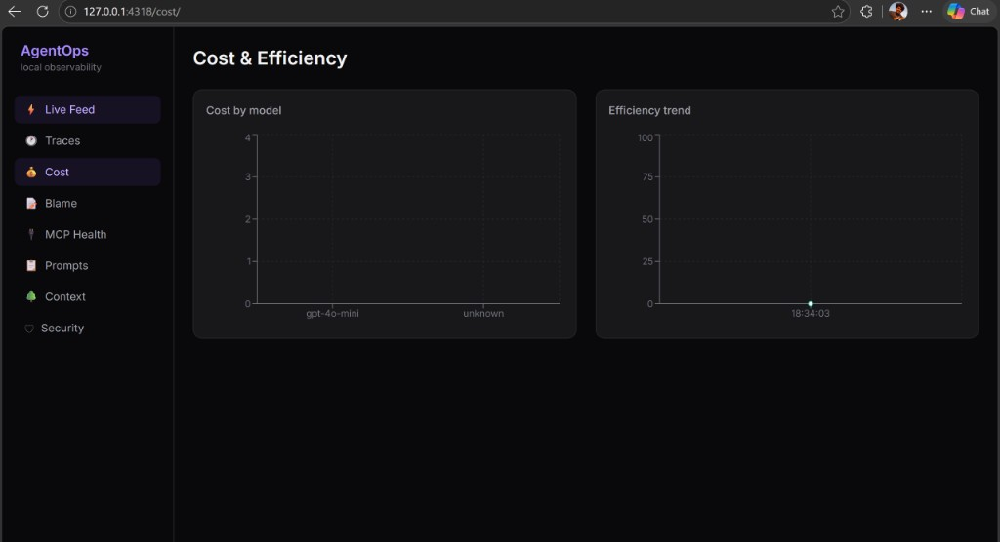
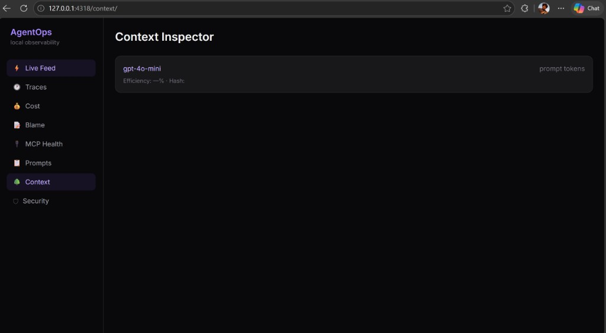
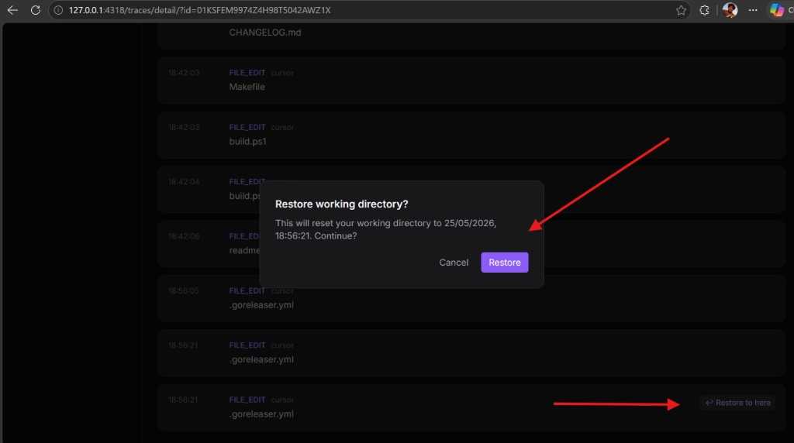

# AgentOps 1.0 — Local AI Agent Observability for Cursor, Claude & Copilot

**AgentOps 1.0** is a local-first observability platform for AI coding agents. Install with one command, run `agentops dev`, and get a real-time dashboard at `localhost:4318` — no SDK, no cloud account, no workflow changes. Track LLM costs, audit file edits, replay agent sessions, and restore your working directory to any point in time.

**Install** · [CHANGELOG](../../CHANGELOG.md) · [GitHub Release v1.0.0](https://github.com/gog1withme/AgentOps/releases/tag/v1.0.0)

---

## What's new in 1.0.0

First public release. Everything runs on your machine; secrets are scrubbed before storage.

- **CLI** — `agentops init`, `dev`, `env`, `version`, `doctor`, `budget`, `restore`, `trace`, `replay`, `blame`, `prompt`, `mcp`, `alerts`, `sec`
- **Passive data collection** — OpenAI-compatible LLM proxy, shell hooks, filesystem watcher, MCP monitoring
- **Privacy** — Pre-storage scrubber with configurable patterns (`sk-*`, AWS keys, JWTs, `.env` values)
- **Budgets** — Session cost/tool/LLM limits with alert, pause, and kill actions
- **Storage** — DuckDB (macOS/Linux) and SQLite (Windows) event store
- **Dashboard** — Live activity feed, traces with replay, cost & efficiency charts, AI blame, MCP health, prompt versions, context inspector, security center, budget banner
- **Distribution** — GitHub Releases, install scripts, Homebrew tap

---

## Dashboard tour

### Live Activity Feed

Real-time SSE stream of everything your agents do — LLM calls, file edits, shell commands, and MCP calls — with timestamps, agent names, and cost badges on LLM events.



### Cost & Efficiency

Track spend by model and watch token efficiency over time. See which models drive cost and whether your context is actually being used.



### Context Inspector

Inspect recent LLM calls: model, prompt token count, efficiency score, prompt hash, and referenced files. Spot bloated context before it hits your API bill.



### Trace Replay + Restore

Open any session timeline and click **Restore to here** on any event to roll back your entire working directory to that moment — tracked files via git patches, untracked files via snapshot copies.



---

## Developer use cases

Scenario-driven examples from real coding sessions. Each includes commands to reproduce the workflow.

### Audit agent file changes during release prep

You're shipping v1.0.0 and ask Cursor to update CI config. Over 15 minutes it touches `.goreleaser.yml`, `Makefile`, `build.ps1`, and `readme.md`. Without AgentOps you rely on `git diff` after the fact. With the live feed, every `FILE_EDIT` appears in real time with timestamp and agent name — a flight recorder for what the agent actually changed.

**Try it**

```bash
agentops init
agentops env          # run the printed command, then restart Cursor
agentops dev
# Open http://localhost:4318 — edit files via Cursor and watch FILE_EDIT events stream in
```

### Control LLM spend before a long session

You're about to refactor a large module with Cursor using `gpt-4o-mini`. Set a budget cap first, then watch the Cost by model chart fill as calls accumulate. The dashboard banner warns at 80% of your limit; at 100% AgentOps can alert, pause, or kill the agent process.

**Try it**

```bash
agentops budget set --cost 2.00 --tools 50 --action alert
agentops dev
# Work in Cursor — check http://localhost:4318/cost/ for spend by model
agentops budget status
```

### Spot wasted context before your bill spikes

Context Inspector shows a call with 40,000 prompt tokens but only 12% efficiency — most of the context was never referenced in the output. Trim `@`-referenced folders, drop stale docs from context, or split the task into smaller prompts before the next chat.

**Try it**

```bash
agentops dev
# After a few Cursor chats, open http://localhost:4318/context/
# Look for low efficiency scores (red badge = under 40%)
```

### Undo a bad refactor in one click

Cursor edits six files over twenty minutes. The migration is wrong and you don't want to manually revert. Open **Traces**, pick the session, scroll to the last good event (e.g. 18:42:03 before `.goreleaser.yml` changes), click **Restore to here**, and confirm. Your working tree resets to that snapshot.

**Try it**

```bash
agentops dev
# After agent edits, open http://localhost:4318/traces/ → select session → Restore to here
# Or from the terminal:
agentops restore --dry-run
agentops restore --at "2026-05-25T18:42:03"
```

### See who changed a file (AI blame)

Production bug in `src/auth.ts` — was it you or the agent? Search the file path in **Blame** or run `agentops blame src/auth.ts` to see every AI-caused edit: timestamp, agent, lines added/removed, and diff.

**Try it**

```bash
agentops blame src/auth.ts
# Or open http://localhost:4318/blame/ and enter the file path
```

### Debug a slow MCP server

After adding a new MCP server to `mcp.json`, tool calls feel sluggish. **MCP Health** shows per-server call count, error rate, and p95 latency. A server flagged "p95 > 2s" or "error rate > 10%" points you to the integration, not the model.

**Try it**

```bash
agentops mcp list
# Open http://localhost:4318/mcp/ after triggering MCP tools in Cursor
```

### Compare prompt versions after a system instruction tweak

You changed your Cursor rules or system prompt. AgentOps captures each version by SHA-256 hash and links it to LLM calls. Compare two hashes to see exactly what changed and whether cost or efficiency shifted.

**Try it**

```bash
agentops prompt list
agentops prompt diff <hash_a> <hash_b>
# Or open http://localhost:4318/prompts/ and use the Compare panel
```

---

## Install

```bash
# macOS / Linux
curl -fsSL https://raw.githubusercontent.com/gog1withme/AgentOps/main/scripts/install.sh | sh

# macOS (Homebrew)
brew tap gog1withme/homebrew-agentops
brew install agentops

# Windows (PowerShell)
irm https://raw.githubusercontent.com/gog1withme/AgentOps/main/scripts/install.ps1 | iex
```

After install:

```bash
agentops init
agentops env          # run the printed command in your shell
# Restart Cursor so it picks up OPENAI_BASE_URL / ANTHROPIC_BASE_URL
agentops dev          # dashboard at http://localhost:4318
```

See [readme.md](../../readme.md) for build-from-source instructions and the full command reference.

---

## Keywords

`ai-agent-observability` · `cursor-monitoring` · `llm-cost-tracking` · `local-first` · `mcp-health` · `opentelemetry` · `ai-coding-agents` · `token-efficiency` · `trace-replay` · `time-travel-restore` · `privacy-scrubbing` · `zero-sdk`

See also: [Roadmap](../ROADMAP.md) · [Developer Q&A](../qa/)
